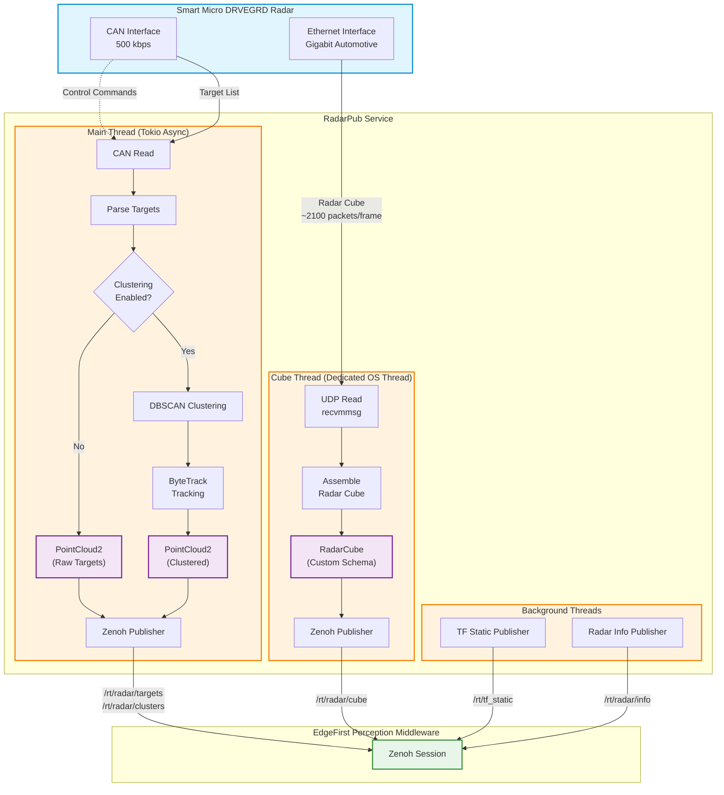
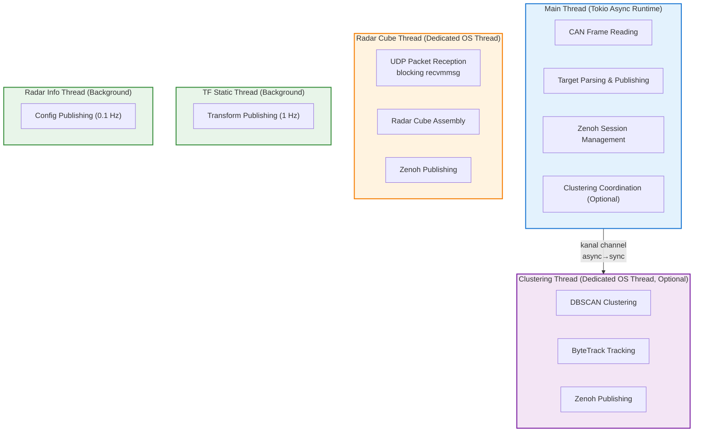
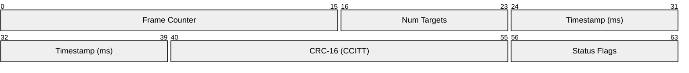
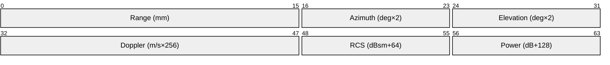
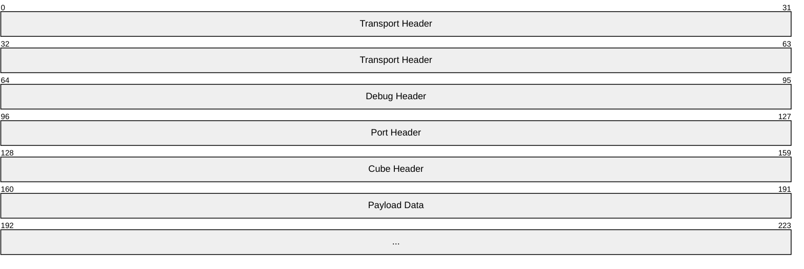
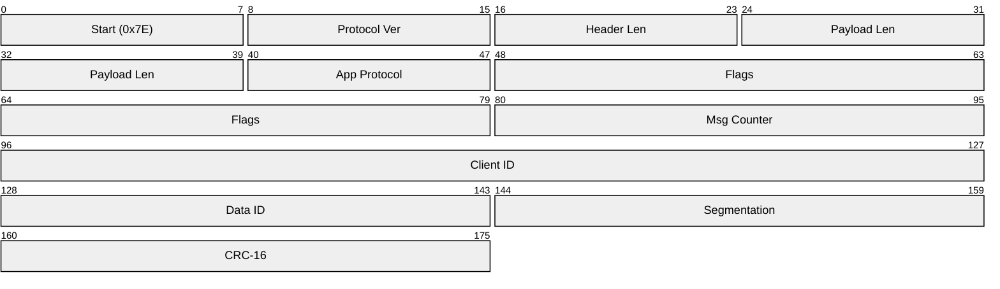
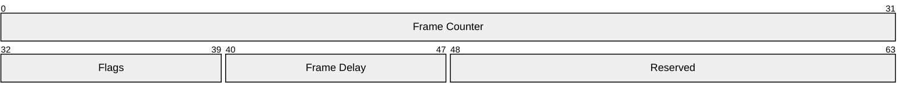
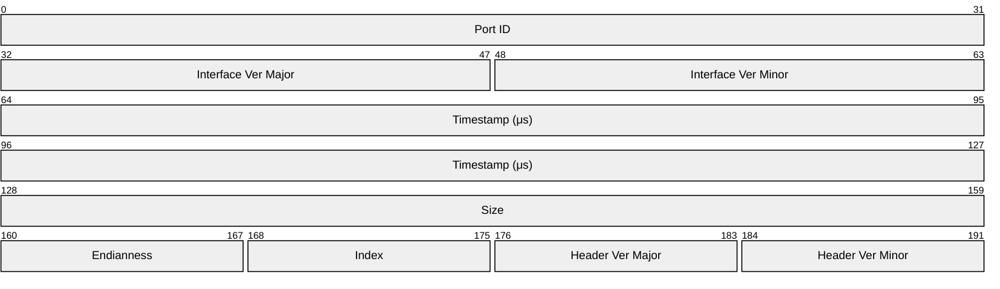
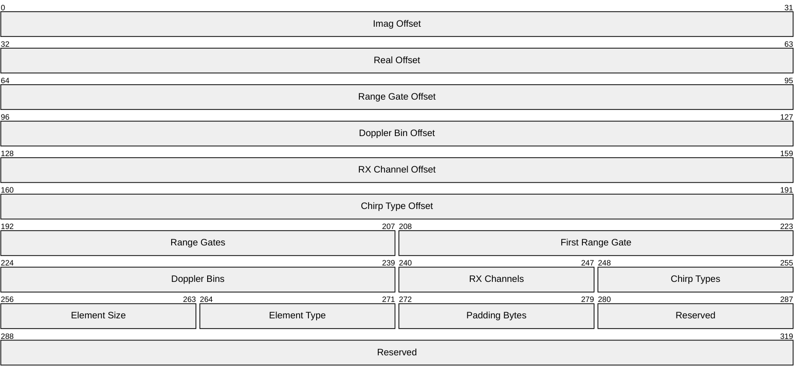
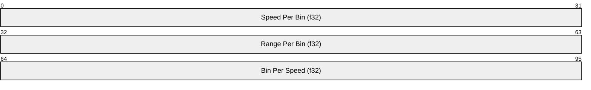

# RadarPub Architecture

**Version:** 1.0.0
**Last Updated:** 2025-01-25
**Audience:** Developers, system integrators, technical contributors

This document describes the internal architecture of RadarPub: threading model, protocol implementations, data flow, and integration points.

---

## Table of Contents

1. [System Overview](#system-overview)
2. [Component Architecture](#component-architecture)
3. [Threading Model](#threading-model)
4. [Data Flow](#data-flow)
5. [Protocol Implementations](#protocol-implementations)
6. [Signal Processing](#signal-processing)
7. [Zenoh Integration](#zenoh-integration)
8. [Message Formats](#message-formats)
9. [Tracy Profiling](#tracy-profiling)
10. [Error Handling](#error-handling)

---

## System Overview

RadarPub is a real-time sensor processing node that bridges Smart Micro DRVEGRD automotive radar sensors to the EdgeFirst Perception Middleware. It implements the DRVEGRD protocol stack (CAN + Ethernet) and publishes ROS2-compatible messages over Zenoh.

### Design Goals

- **Low Latency**: Minimize processing time from sensor to Zenoh publish
- **High Throughput**: Handle multiple targets per frame at sensor frame rates
- **Fault Tolerance**: Graceful degradation on sensor errors
- **Observability**: Tracy profiling instrumentation throughout hot paths

### High-Level Architecture



---

## Component Architecture

### Module Structure

```text
src/
├── radarpub.rs          # Main application entry point, async runtime
├── can.rs               # CAN interface and DRVEGRD UATv4 protocol
├── eth.rs               # Ethernet/UDP interface and SMS protocol
├── net.rs               # Network socket management and optimizations
├── args.rs              # CLI argument parsing (clap)
├── common.rs            # Shared utilities (process priority, networking)
├── drvegrdctl.rs        # Configuration utility (separate binary)
├── rerun.rs             # Visualization tool (separate binary)
└── clustering/
    ├── mod.rs           # DBSCAN clustering wrapper
    ├── tracker.rs       # ByteTrack multi-object tracking
    └── kalman.rs        # Kalman filter for state estimation
```

### Binary Targets

| Binary | Features | Purpose |
|--------|----------|---------|
| `radarpub` | `can`, `zenoh` | Main radar publisher node |
| `drvegrdctl` | `can` | Radar configuration utility |
| `drvegrd-rerun` | `rerun` | PCAP visualization tool |

### Feature Flags

| Feature | Description | Default |
|---------|-------------|---------|
| `can` | CAN interface support (requires SocketCAN) | ✅ |
| `zenoh` | Zenoh middleware integration | ✅ |
| `tracy` | Tracy profiler instrumentation | ✅ |
| `profiling` | Extended profiling (allocator tracking) | ❌ |
| `rerun` | Rerun visualization support | ❌ |

---

## Threading Model

RadarPub uses a hybrid threading model: Tokio async runtime for CAN I/O and dedicated OS threads for CPU-intensive processing.

### Thread Overview



### Thread Details

#### Main Thread (Tokio Async)

- **Runtime**: Tokio multi-threaded async executor
- **Responsibilities**:
  - CAN socket management (socketcan-rs async)
  - Target list parsing from CAN frames
  - Zenoh session management
  - PointCloud2 publishing
  - Coordination with clustering thread (if enabled)

**Implementation**: `src/radarpub.rs:main()`

#### Radar Cube Thread (Dedicated OS Thread)

- **Responsibilities**:
  - Bind UDP socket to port 50005
  - Receive SMS protocol packets via `recvmmsg` (Linux)
  - Assemble 4D radar cube from UDP packets
  - Publish RadarCube messages to Zenoh
- **Rationale**: Dedicated thread for blocking `recvmmsg` syscall, separate Zenoh session

**Implementation**: `src/net.rs:port5()`, `src/eth.rs:RadarCubeReader`

#### Clustering Thread (Optional, Dedicated OS Thread)

- **Responsibilities**:
  - Receive target lists via kanal channel
  - Apply DBSCAN clustering algorithm
  - Update ByteTrack multi-object tracker
  - Publish clustered PointCloud2
- **Rationale**: CPU-intensive DBSCAN benefits from dedicated thread
- **Synchronization**: Lock-free kanal channel (async→sync bridge)

**Implementation**: `src/radarpub.rs:clustering_task()`, `src/clustering/mod.rs`

#### Background Threads

- **TF Static**: Publishes static transforms at 1 Hz
- **Radar Info**: Publishes radar configuration at 0.1 Hz

### Inter-Thread Communication

**Kanal Channels** (lock-free MPSC):
- Main thread (async) → Clustering thread (sync)
- Bounded channel (capacity: 16) for backpressure
- Zero-allocation design in steady state

---

## Data Flow

### Target List Processing (CAN Path)

1. **CAN Frame Reception** (`src/can.rs:read_frame()`)
   - Async read from SocketCAN socket
   - Extended frame format (29-bit CAN IDs)
   - Frame filtering by CAN ID

2. **Multi-Frame Assembly** (`src/can.rs:read_message()`)
   - Header frame (ID 0x1A0): 3 sequential frames
   - Target frames (ID 0x1A1+): 2 frames per target
   - CRC-16 CCITT validation on header

3. **Target Parsing** (`src/can.rs:Target`)
   - Extract range, azimuth, elevation, doppler, RCS, power
   - Convert to SI units (meters, m/s, dBsm)

4. **Optional: Clustering** (`src/clustering/mod.rs:cluster()`)
   - DBSCAN spatial clustering (configurable epsilon, min_points)
   - Assign cluster IDs to targets

5. **Optional: Tracking** (`src/clustering/tracker.rs:ByteTrack`)
   - Kalman filter prediction
   - Hungarian algorithm (LAPJV) for data association
   - Track lifecycle management

6. **PointCloud2 Generation** (`src/radarpub.rs`)
   - Pack data into ROS2 PointCloud2 format
   - Fields: x, y, z, speed, power, rcs, [cluster_id]
   - CDR serialization (little-endian)

7. **Zenoh Publishing**
   - Topic: `/rt/radar/targets` or `/rt/radar/clusters`
   - Encoding: `application/cdr` with ROS2 schema

### Radar Cube Processing (UDP Path)

1. **UDP Packet Reception** (`src/net.rs:port5()`)
   - Linux `recvmmsg` for bulk reception (64 packets per call)
   - SMS protocol packet validation
   - Fixed packet size: 1458 bytes

2. **Radar Cube Assembly** (`src/eth.rs:RadarCubeReader::read()`)
   - Multi-packet cube assembly (~2100 packets per frame)
   - 4D tensor: `[chirp_types, range_gates, rx_channels, doppler_bins]`
   - Complex i16 data (interleaved I/Q samples)
   - Packet loss detection

3. **RadarCube Message** (`src/radarpub.rs`)
   - EdgeFirst custom message format
   - Includes bin properties (range/doppler/angle calibration)
   - CDR serialization

4. **Zenoh Publishing**
   - Topic: `/rt/radar/cube`
   - Large message handling (SHM when available)

---

## Protocol Implementations

### CAN Protocol (DRVEGRD UATv4)

**Overview:**
- 500 kbps CAN bitrate
- Extended frame format (29-bit IDs)
- Multi-frame message protocol
- Bidirectional: Host ↔ Radar

**Frame Types:**

1. **Header Frame (ID 0x1A0)**:
   - 3 sequential CAN frames required
   - Contains: frame counter, target count, timestamp, CRC-16
   - CRC algorithm: CRC-16 CCITT (polynomial 0x1021)



2. **Target Frames (ID 0x1A1-0x1AF)**:
   - 2 CAN frames per target
   - Fields: range, azimuth, elevation, doppler, RCS, power



**Implementation**: `src/can.rs`

### Ethernet Protocol (Smart Micro SMS)

**Overview:**
- UDP broadcast on port 50005
- Fixed packet size: 1458 bytes
- Unidirectional: Radar → Host
- Transport header + payload structure

**Packet Structure:**

**SMS Packet (1458 bytes total):**



- **Transport Header** (variable length):
  - Start pattern (0x7E), protocol version, header length
  - Payload length, application protocol
  - Optional: message counter, client ID, data ID, segmentation
  - CRC-16 checksum



- **Debug Header** (8 bytes):
  - Frame counter, flags, frame delay
  - Flags: START_OF_FRAME, FRAME_DATA, FRAME_FOOTER, END_OF_DATA



- **Port Header** (24 bytes):
  - Port ID, interface version, timestamp
  - Data size, endianness, index



- **Cube Header** (40 bytes):
  - Memory offsets (real, imaginary, range gate, doppler, channel, chirp type)
  - Dimensions (range gates, doppler bins, channels, chirp types)
  - Element type and size



- **Bin Properties** (12 bytes):
  - speed_per_bin, range_per_bin, bin_per_speed (f32)



**Radar Cube Tensor:**
- Dimensions: `[chirp_types, range_gates, rx_channels, doppler_bins]`
- Typical: `[4, 256, 12, 64]` = 786,432 complex i16 values
- Total size: ~3 MB per frame
- Packet count: ~2100 packets per cube

**Implementation**: `src/eth.rs`, `src/net.rs`

---

## Signal Processing

### DBSCAN Clustering

**Purpose**: Group spatially proximate radar targets into clusters

**Algorithm**:
1. Convert targets to 4D points (x, y, z, speed)
2. Apply configurable parameter scaling
3. Run DBSCAN with epsilon and min_points thresholds
4. Assign cluster IDs (0 for noise, 1+ for valid clusters)

**Configuration**:
- `--clustering-eps`: Spatial distance threshold (default: 1.0)
- `--clustering-point-limit`: Minimum points per cluster (default: 5)
- `--clustering-param-scale`: Scaling for x,y,z,speed (default: "1 1 0 0")

**Implementation**: `src/clustering/mod.rs:cluster()`

### ByteTrack Multi-Object Tracking

**Purpose**: Maintain consistent track IDs across frames

**Algorithm**:
1. **Prediction**: Kalman filter predicts target states
2. **Association**: Hungarian algorithm (LAPJV) for matching
3. **Update**: Update track states with detections
4. **Management**: Create/remove tracks based on lifecycle

**Track State**:
- `Tracklet`: Individual track with UUID and Kalman filter
- `ByteTrack`: Manages active, lost, and removed tracklets
- `TrackSettings`: Configuration for thresholds and lifespan

**Kalman Filter**:
- Model: Constant Velocity XYAH (position + aspect ratio + height)
- State: `[x, y, aspect, height, vx, vy, va, vh]`
- Standard predict-update cycle

**Implementation**: `src/clustering/tracker.rs`, `src/clustering/kalman.rs`

---

## Zenoh Integration

### Session Configuration

- Created from CLI arguments in `src/radarpub.rs:main()`
- Modes: peer, client, or router
- Endpoint configuration via `--connect` argument
- Separate sessions for main thread and cube thread

### Topic Structure

```
/rt/                    # Real-time namespace
  radar/
    targets             # Raw target detections (PointCloud2)
    clusters            # Clustered targets (PointCloud2)
    cube                # 4D radar cube (RadarCube)
    info                # Radar configuration (RadarInfo)
  tf_static             # Static transforms (TransformStamped)
```

### Publishing Pattern

- Serialize with CDR (Common Data Representation)
- Attach schema via `Encoding::APPLICATION_CDR.with_schema()`
- Use `ZBytes::from()` for message wrapping
- QoS: Default priority, CongestionControl::Block

**Implementation**: `src/radarpub.rs` publish functions

---

## Message Formats

### sensor_msgs/PointCloud2

ROS2 standard message for point clouds.

**Structure**:
- Header: timestamp, frame_id
- height: 1 (unordered cloud)
- width: point count
- fields: Array of PointField descriptors
- data: Packed binary array (little-endian)

**Field Layout (Targets - 24 bytes/point)**:

| Offset | Field  | Type | Size |
|--------|--------|------|------|
| 0      | x      | f32  | 4    |
| 4      | y      | f32  | 4    |
| 8      | z      | f32  | 4    |
| 12     | speed  | f32  | 4    |
| 16     | power  | f32  | 4    |
| 20     | rcs    | f32  | 4    |

**Field Layout (Clusters - 28 bytes/point)**:

| Offset | Field      | Type | Size |
|--------|------------|------|------|
| 0-23   | (as above) | —    | 24   |
| 24     | cluster_id | i32  | 4    |

### edgefirst_msgs/RadarCube

Custom message for 4D radar data.

**Structure**:
- Header: timestamp, frame_id
- frame_counter: u32
- packets_captured: u16
- packets_skipped: u16
- missing_data: usize
- bin_properties: BinProperties
- data: 4D ndarray (Complex<i16>)

**Serialization**: CDR little-endian

**Schema**: `edgefirst_msgs/msg/RadarCube`

---

## Tracy Profiling

RadarPub includes Tracy profiler instrumentation for performance analysis.

### Build Configuration

```bash
# Build with Tracy (default)
cargo build --release --features tracy

# Extended profiling (allocator tracking)
cargo build --release --features profiling
```

### Instrumented Spans

**CAN Path**:
- CAN frame reception
- Target parsing
- Clustering execution
- Tracking update
- PointCloud2 publishing

**Cube Path**:
- UDP packet reception
- Cube assembly
- RadarCube publishing

### Frame Markers

- `frame_mark()`: Main CAN processing frames
- `secondary_frame_mark()`: Cube assembly frames

### Usage

```bash
# Terminal 1: Run radarpub
./radarpub --can-interface can0

# Terminal 2: Connect Tracy profiler
tracy-profiler
```

**Implementation**: `tracing-tracy` crate integration

---

## Error Handling

### Error Types

Custom error enums:
- `can::Error`: CAN communication, protocol violations, CRC mismatches
- `eth::SMSError`: UDP reception, SMS protocol parsing, cube assembly

Implemented with `thiserror` for ergonomic error propagation.

### Fault Tolerance

1. **Frame-Level Recovery**: Skip malformed CAN frames, continue processing
2. **Cube-Level Recovery**: Detect missing UDP packets, publish partial cubes
3. **Graceful Logging**: Log errors without halting pipeline

**Implementation**: Throughout `src/can.rs`, `src/eth.rs`, `src/radarpub.rs`

---

## References

- **Smart Micro DRVEGRD**: Automotive radar sensor technical documentation
- **Zenoh**: [https://zenoh.io/](https://zenoh.io/)
- **ROS2 sensor_msgs**: [https://docs.ros.org/](https://docs.ros.org/)
- **EdgeFirst Perception**: Multi-sensor fusion middleware
- **edgefirst-schemas**: Message format definitions crate

---

**Document Version**: 1.0.0  
**Last Updated**: 2025-01-25  
**Contact**: support@au-zone.com
